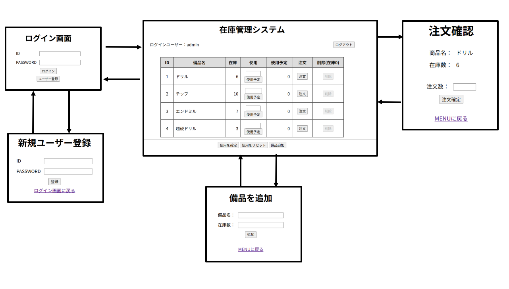
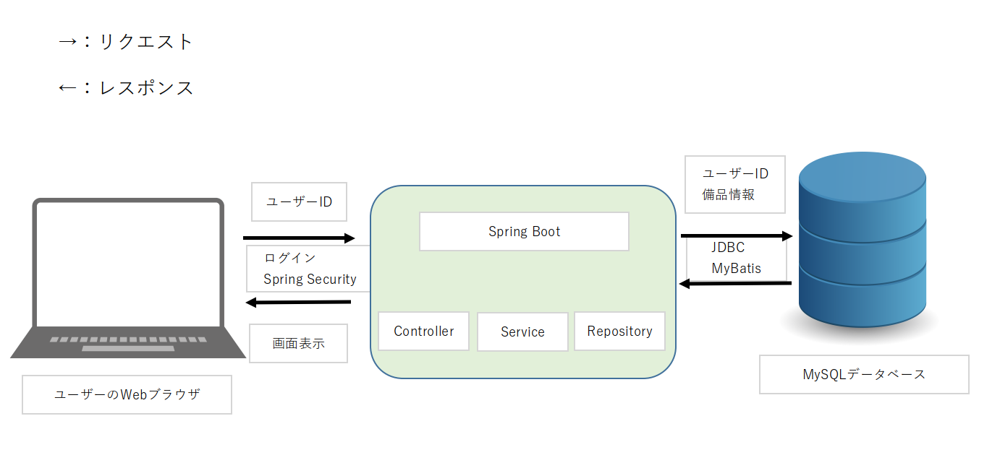

# 備品在庫管理システム（Supplies）

Spring Boot を使用して作成した **備品在庫管理 Web アプリケーション** です。  
製造業での現場経験を活かし、業務改善の観点から「在庫管理の効率化」を目的として開発しました。

---

## 開発の目的
- 前職の製造業で、備品の在庫管理や使用数の把握が手作業で非効率だった  
- IT 技術を活用して作業効率向上・ヒューマンエラー削減を実現  
- IT 技術習得を目的としたポートフォリオとして作成

---

## 機能一覧
- ユーザー登録 / ログイン / ログアウト（Spring Security）
- 備品一覧表示
- 備品の追加・削除
- 備品の注文（在庫追加）
- 使用数の仮登録
- 使用数の一括確定
- 使用数のリセット

---

## 使用技術
- **言語・フレームワーク**: Java, Spring Boot, Spring Security, Thymeleaf  
- **データベース / ORM**: MySQL, MyBatis  
- **その他**: Lombok
---
## 画面遷移図

---
## システム構成図



本システムは、Spring Boot を中心とした MVC 構成で実装しています。  
認証には Spring Security を使用し、データベース操作は MyBatis（JDBC）を通じて MySQL にアクセスします。

---
## 画面・URL 一覧
```
 URL           | 内容             
---------------|------------------
 /login        | ログイン画面      
 /register     | ユーザー登録画面  
 /menu         | 備品一覧画面     
 /menu/add     | 備品追加画面     
```
---
## ディレクトリ構成
```
com.example.supplies
├─ controller // 画面遷移・リクエスト処理
├─ service // 業務ロジック
├─ repository // DB操作（MyBatis）
├─ entity // エンティティ
├─ security // 認証・認可（Spring Security）
└─ config // 設定クラス
```
---

## 認証の流れ（Spring Security）
1. ログイン画面から ID・パスワードを送信  
2. `UserDetailsServiceImpl` が DB からユーザーを取得  
3. `LoginUser` に変換  
4. `BCrypt` でパスワード照合  
5. ログイン成功後 `/menu` へ遷移  

---
## 環境構築について
- DB接続情報（ユーザー名・パスワード）は  
- 環境変数で管理しており、GitHub上には含めていません。
---

## 工夫した点
- Service 層で業務ロジックを集中管理  
- 使用数を **「仮登録 → 確定」** の 2 段階方式で実装  
- Spring Security によるセッション管理で安全な認証を実現    

---

## 今後の改善予定
- 管理者専用画面の追加  
- 使用・注文履歴の管理  
- エラーメッセージの詳細化

